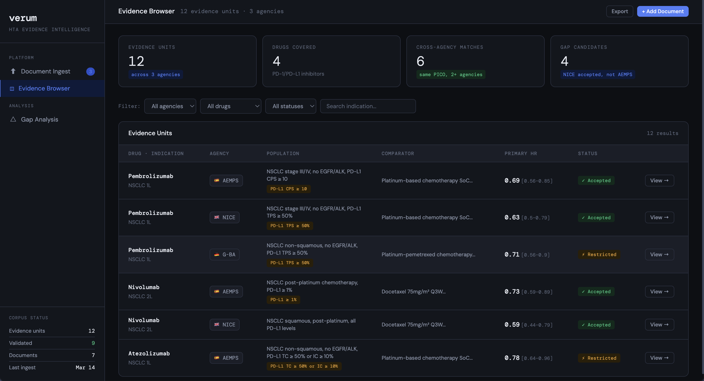

# Verum — HTA Evidence Intelligence Platform

> Concept architecture · March 2026 · Portfolio artifact

---

## What It Is

Verum is a structured evidence intelligence platform designed for pharmaceutical HTA (Health Technology Assessment) workflows. It mines published HTA decisions — Spanish IPTs, NICE STAs, G-BA dossiers, HAS decisions — extracts the implied PICO specifications from each, and maps them cross-country to surface the minimum evidence set needed to satisfy multiple national markets for a given drug and indication.

This repository documents the concept architecture, data model, and pipeline design. It is a portfolio artifact developed alongside [Evidence Mapper](https://evidence-mapper.com) to demonstrate product and data architecture thinking in regulated health data contexts.

**Status:** Architecture designed and validated. Data model complete. UI prototype live.

---

## Prototype

> UI prototype showing the Evidence Browser, PICO-structured evidence units across AEMPS, NICE, and G-BA, and the Gap Analysis view.
> [**Open prototype →**](https://mczuzu.github.io/verum/prototype.html)
---

## The Core Insight

Every published HTA decision contains an **implicit study specification**: the population, comparator, endpoints, and study design that the agency actually accepted. That specification is machine-extractable from narrative PDFs using structured LLM extraction.

An IPT (Spain) is not just a decision document — it is a reverse-engineered study protocol. Mine enough of them and you have a rules engine. The corpus is entirely public. Nobody has built a structured database from it.

---

## The Problem It Solves

Pharma HEOR teams preparing for multi-country market access ask: *what study design satisfies Spain, Germany, France, and the UK simultaneously — and where do their requirements diverge?*

Today this is a manual consulting engagement costing €50,000–200,000 and taking several weeks. Verum answers it with every inference traceable to a specific published HTA decision.

---

## Architecture

Four pipeline layers, each gated by explicit human approval before advancing.

| Layer | Input | Process | Output |
|---|---|---|---|
| **1 — Ingestion** | Published HTA decision PDFs (IPTs, STAs, G-BA, HAS) | LLM extraction with structured PICO prompts | Raw evidence bundles in JSON |
| **2 — Structuring** | Raw JSON bundles | Schema validation + human field-by-field review | Validated EvidenceUnit database |
| **3 — Localisation** | EvidenceUnits + country HTA rules | Rules + LLM hybrid mapping to national templates | Draft dossier skeleton, section-by-section |
| **4 — Output** | Approved section map | Document generation with inline citation trail | Word/PDF with EvidenceUnit citations per claim |

---

## The EvidenceUnit — Core Data Object

The minimum reusable evidence object. One EvidenceUnit can populate multiple country dossiers. Stored as JSONB in PostgreSQL/Supabase, indexed by indication composite key: `{drug_id, condition_code, subgroup_filter, line_of_therapy}`.

Schema is aligned with GRADE evidence tables and PRISMA reporting standards.

| Field | Description | Example |
|---|---|---|
| `study_reference` | Source ID, database, study type | PubMed 38291045, RCT |
| `population_json` | PICO P: inclusion criteria, sample size | NSCLC stage III/IV, n=847 |
| `intervention_json` | PICO I: drug, dose, duration | Pembrolizumab 200mg Q3W |
| `comparator_json` | PICO C: standard of care, active comparator | Platinum-based chemo |
| `outcome_json` | PICO O: endpoint, numeric value, CI | OS HR 0.73 [0.58–0.92] |
| `evidence_quality` | GRADE level, risk of bias — human-assigned | High, low risk of bias |
| `hta_context_json` | Country, agency, applicable guidelines | ES, AEMPS, IPT criteria |
| `version` | Append-only audit trail — never overwrite | v1.2, updated 2026-01-15 |
| `extraction_meta` | LLM model version, prompt template version, confidence per field | gpt-4o, prompt-v3, OS: 0.91 |

---

## Human-in-the-Loop Design

Every pipeline phase produces a draft that a human must approve before the pipeline advances. The audit trail captures who approved, what version, when, and with what role.

| Phase | Human Task | Effort |
|---|---|---|
| P1 — Ingestion | HEOR Scientist reviews retrieved study set; approves or refines query | ~1–2 hrs per indication |
| P2 — Structuring | Field-by-field EvidenceUnit review; GRADE assignment validated | ~3–5 min per unit |
| P3 — Localisation | Section mapping review; evidence gaps resolved; comparator confirmed | ~2–4 hrs per country |
| P4 — Output | Full dossier draft reviewed; citations verified; Medical Director sign-off | ~4–8 hrs from complete draft |

This is not a constraint — it is the trust model. No AI tool in HTA has been accepted at submission level without full human accountability.

---

## Regulatory Context

The EU HTA Regulation (HTAR) entered into force January 2025. All new oncology products are now subject to Joint Clinical Assessments (JCAs). The JCA implementing act requires SLR searches no older than 3 months, with the final JCA scope issued only 100 days before the submission deadline.

This compresses timelines brutally. Reusable, versioned EvidenceUnits are the architectural answer to a blank-page rebuild under time pressure.

---

## Data Sources

| Source | Access | Notes |
|---|---|---|
| AEMPS IPT corpus (Spain) | Public PDFs | ~125 published per year; requires PDF parsing + OCR for older docs |
| NICE STAs (UK) | Public PDFs | Structured URLs, downloadable |
| G-BA dossiers (Germany) | Public PDFs | |
| HAS decisions (France) | Public PDFs | |
| PubMed / ClinicalTrials.gov | Public REST APIs | Rate-limited; free with API key |
| Embase | Licensed | Table-stakes for HTA literature searches; client-provided or CRO partnership |

---

## Tech Stack (Designed)

- **Database:** PostgreSQL / Supabase — JSONB fields, append-only EvidenceUnit records
- **Extraction:** OpenAI GPT-4 / Claude — structured PICO prompts, confidence scoring per field
- **Document output:** python-docx, pandoc
- **Frontend:** React + TypeScript + Tailwind
- **Hosting:** Vercel

---

## What This Is Not

- Not an AI that writes HTA dossiers — output is structured evidence intelligence, not regulatory narrative
- Not a literature search engine — it does not replace PubMed or Embase queries
- Not a substitute for HEOR expert judgement — it informs decisions, it does not make them
- Not a built product — this is a validated concept with a complete architecture and a documented gap

---

## Related

[Evidence Mapper](https://evidence-mapper.com) — live AI-assisted pipeline over 63,000+ ClinicalTrials.gov completed trials. Built with the same HITL and structured data extraction principles that underpin Verum's architecture.

---

*María Castro · March 2026*
